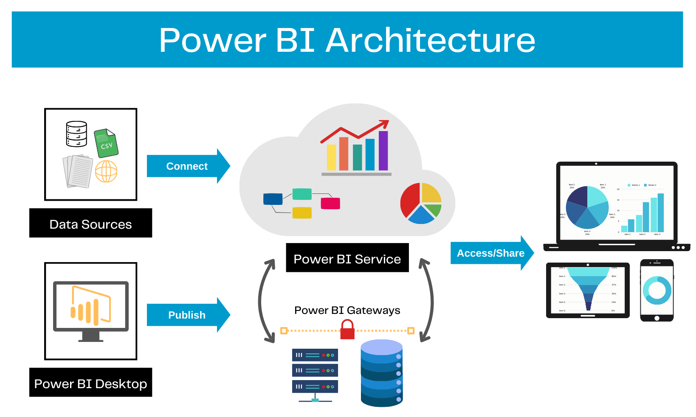
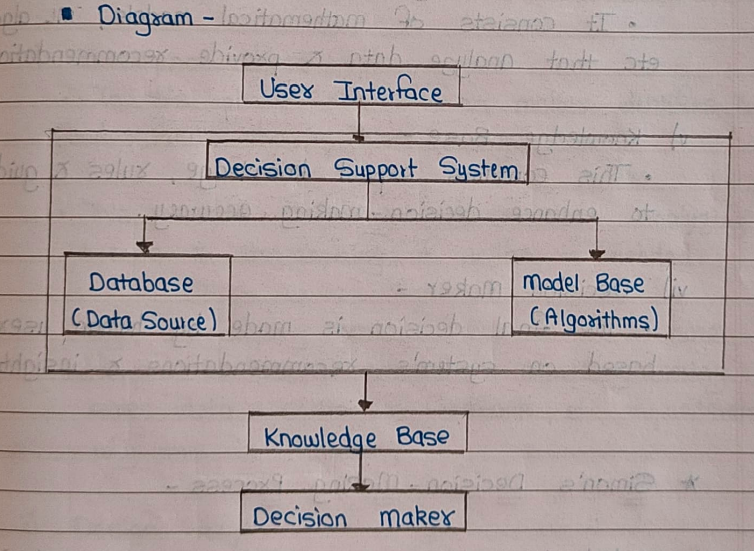

# Introduction to Decision support systems and Business intelligence


### Q1. Define Business Intelligence. Explain Architecture of BI. [5]

### **Business Intelligence (BI) Definition**  
- Business Intelligence (BI) refers to the technologies, processes, and tools used to collect, integrate, analyze, and present business data.
- The goal of BI is to support decision-making by transforming raw data into meaningful insights.
- It helps organizations identify trends, optimize operations, and improve overall performance.
- It involves the use of data analytics, reporting, and visualization tools to extract insights from large volumes of data.

---

### **Architecture of BI**  
The BI architecture consists of several components that work together to process and analyze data effectively. The key components are:

1. **Data Sources**  
   - Data is collected from various sources such as databases, ERP systems, CRM systems, spreadsheets, and external APIs.
   - Sources can be structured (SQL databases) or unstructured (social media, emails).

2. **ETL (Extract, Transform, Load)**  
   - **Extract:** Data is extracted from different sources.  
   - **Transform:** The extracted data is cleaned, formatted, and integrated into a unified format.  
   - **Load:** The processed data is stored in a data warehouse or a data mart for analysis.

3. **Data Warehouse**  
   - A central repository where processed data is stored for querying and reporting.  
   - It supports historical data storage and allows fast retrieval for analysis.

4. **OLAP (Online Analytical Processing) & Data Mining**  
   - OLAP tools allow multidimensional data analysis and fast querying.  
   - Data mining techniques help identify patterns and correlations in large datasets.

5. **Business Intelligence Tools (Visualization & Reporting)**  
   - BI tools like Power BI, Tableau, and QlikView generate reports, dashboards, and interactive visualizations.  
   - These tools help business users make informed decisions.

6. **End-User Access (Decision Support System - DSS)**  
   - The final layer where users interact with the BI system to gain insights.  
   - Decision-makers use reports and dashboards to analyze trends, monitor KPIs, and make strategic decisions.



### **Diagram Representation (BI Architecture)**  
```
Data Sources → ETL Process → Data Warehouse → OLAP & Data Mining → BI Tools → End-User Access
```
1. **Better Decision-Making** – Provides real-time insights and data-driven decision-making.  
2. **Improved Efficiency** – Automates data analysis, reducing manual efforts and errors.  
3. **Enhanced Data Visualization** – Offers interactive dashboards and reports for better understanding.  
4. **Competitive Advantage** – Helps identify market trends and customer behavior for strategic planning.

----

### Q2. Explain the representation of decision-making process with block diagram. [5]

### **Decision-Making Process Representation**  

The **Decision-Making Process** involves a series of steps that help individuals or organizations choose the best course of action among multiple alternatives. It is essential in business, management, and everyday scenarios to achieve optimal outcomes.

---

### **Steps in the Decision-Making Process**  

1. **Problem Identification**  
   - Recognizing and defining the issue or opportunity that requires a decision.

2. **Data Collection & Analysis**  
   - Gathering relevant information from internal and external sources.
   - Analyzing data using statistical methods, BI tools, or expert opinions.

3. **Identifying Alternatives**  
   - Listing all possible courses of action to resolve the issue.

4. **Evaluation of Alternatives**  
   - Comparing alternatives based on factors like cost, feasibility, risks, and benefits.

5. **Selection of the Best Alternative**  
   - Choosing the most suitable option based on analysis and evaluation.

6. **Implementation of the Decision**  
   - Executing the chosen solution, allocating resources, and assigning responsibilities.

7. **Monitoring & Feedback**  
   - Assessing the effectiveness of the decision.
   - Making adjustments if necessary based on feedback.

---

### **Block Diagram of Decision-Making Process**  

Below is a simplified representation of the decision-making process:

```
+-------------------------+
|  Problem Identification |
+-------------------------+
           ↓
+-------------------------+
|  Data Collection & Analysis |
+-------------------------+
           ↓
+-------------------------+
|  Identifying Alternatives  |
+-------------------------+
           ↓
+-------------------------+
|  Evaluation of Alternatives |
+-------------------------+
           ↓
+-------------------------+
|  Selection of Best Alternative |
+-------------------------+
           ↓
+-------------------------+
|  Implementation of Decision |
+-------------------------+
           ↓
+-------------------------+
|  Monitoring & Feedback  |
+-------------------------+
```

This structured approach ensures a logical, data-driven, and efficient method for making sound decisions in various domains.

---

### Q3. Draw and explain schematic view of Decision Support System. [5]

### **Schematic View of Decision Support System (DSS)**  

A **Decision Support System (DSS)** is a computer-based system that assists decision-makers in analyzing data, making informed decisions, and solving complex problems. It integrates data, models, and user-friendly interfaces to provide actionable insights.  



### **1. User Interface**  
   - The **front-end** component that allows decision-makers to interact with the DSS.  
   - Provides a way to input queries and view processed data, reports, and insights.  

### **2. Decision Support System**  
   - The **core system** that integrates data, models, and analytical tools.  
   - It processes information from databases and model bases to provide decision-making support.  

### **3. Database (Data Source)**  
   - Stores **raw data** from various sources, including business records, market trends, and historical data.  
   - Provides structured data to the DSS for further analysis.  

### **4. Model Base (Algorithms)**  
   - Contains **mathematical and statistical models, AI algorithms, and decision rules** to process data.  
   - Helps in **evaluating different alternatives** and generating possible solutions.  

### **5. Knowledge Base**  
   - Stores **expert knowledge, business rules, and past decisions** to enhance decision-making.  
   - Helps in **making more informed and intelligent choices** based on historical insights.  

### **6. Decision Maker**  
   - The **end-user** (manager, analyst, or executive) who receives insights from the DSS.  
   - Makes the **final decision** based on the recommendations and information provided.  

---

### **Workflow of DSS (Based on the Diagram)**  

1. The **User Interface** interacts with the DSS.  
2. The DSS retrieves data from the **Database** (Data Source).  
3. The **Model Base** (Algorithms) processes this data using decision models.  
4. The processed data and insights are stored in the **Knowledge Base** for future use.  
5. The final recommendations are presented to the **Decision Maker** for action. 

### **Applications of DSS**  
- **Business & Management:** Market analysis, financial forecasting, risk assessment.  
- **Healthcare:** Disease diagnosis, patient treatment plans.  
- **Manufacturing:** Supply chain optimization, inventory control.  
- **Finance:** Investment portfolio analysis, fraud detection.  

A DSS enhances efficiency, reduces risks, and improves decision accuracy, making it a valuable tool in various industries.

This structured approach helps businesses and organizations **improve decision-making, optimize strategies, and reduce risks.**

---

### Q4. State and explain with example stages of Simon’s decision-making process. [5]

### **Simon's Decision-Making Process**  

Herbert A. Simon proposed a **three-stage decision-making model** that helps in understanding how decisions are made in a structured manner. These stages are:  

1. **Intelligence Stage**  
2. **Design Stage**  
3. **Choice Stage**  

A fourth stage, **Implementation**, is sometimes added to ensure the decision is executed effectively.  

---

### **1. Intelligence Stage** (Problem Identification)  
- This stage involves **gathering information**, identifying problems, and recognizing opportunities.  
- Data is collected from internal and external sources to understand the situation.  

📌 **Example:**  
A company notices a drop in sales. It gathers data from customer feedback, market trends, and competitor analysis to understand the issue.  

---

### **2. Design Stage** (Developing Alternatives)  
- Various **solutions and alternatives** are formulated based on the gathered data.  
- Models, simulations, and analytical tools are used to evaluate different approaches.  

📌 **Example:**  
The company identifies possible solutions, such as **reducing product prices, launching promotions, or improving product quality** to regain market share.  

---

### **3. Choice Stage** (Selecting the Best Solution)  
- The best alternative is selected after analyzing all possible solutions.  
- This involves cost-benefit analysis, risk assessment, and feasibility checks.  

📌 **Example:**  
After evaluating all alternatives, the company decides to **launch a discount offer for existing customers** as the best strategy to boost sales.  

---

### **4. Implementation Stage** (Executing the Decision)  
- The selected decision is implemented in real-world scenarios.  
- Feedback is collected to assess its effectiveness, and necessary adjustments are made.  

📌 **Example:**  
The company **launches the discount campaign, monitors sales performance, and collects customer feedback** to measure the impact.  

---

### **Conclusion**  
Simon's model helps in **structured decision-making** by breaking the process into clear steps. It is widely used in **business, management, and information systems** to improve problem-solving and strategic planning.

---

### Q5. What are the different stages and benefits of Business Intelligence. [5]

### **Stages of Business Intelligence (BI)**  

Business Intelligence (BI) follows a structured process to convert raw data into actionable insights. The stages include:  

#### **1. Data Collection**  
- Gathering data from multiple sources like databases, spreadsheets, web applications, and external APIs.  

#### **2. Data Integration & Cleaning**  
- Combining data from different sources and **removing inconsistencies, duplicates, and errors** to ensure accuracy.  

#### **3. Data Storage (Data Warehousing)**  
- Organizing and storing the cleaned data in a **centralized data warehouse** for easy retrieval.  

#### **4. Data Analysis**  
- Applying **statistical models, AI algorithms, and data mining techniques** to extract meaningful patterns and trends.  

#### **5. Data Visualization & Reporting**  
- Presenting data insights through **dashboards, charts, and reports** to support decision-making.  

#### **6. Decision-Making & Action**  
- Using BI insights to make **strategic business decisions**, optimize operations, and improve performance.  

---

### **Benefits of Business Intelligence (BI)**  

✅ **Better Decision-Making**  
   - Provides **real-time, data-driven insights** to make informed business decisions.  

✅ **Improved Efficiency**  
   - Automates data processing, reducing manual efforts and saving time.  

✅ **Competitive Advantage**  
   - Helps businesses understand market trends, customer behavior, and competitors.  

✅ **Cost Optimization**  
   - Identifies areas of waste and inefficiency, leading to cost savings.  

✅ **Enhanced Customer Satisfaction**  
   - Personalizes customer experiences using **data insights** and feedback analysis.  

✅ **Risk Reduction**  
   - Identifies **potential risks and fraud** by analyzing patterns in financial and operational data.  

✅ **Scalability**  
   - BI systems grow with the business, supporting expansion and data-driven strategy shifts.  

---

### **Conclusion**  
Business Intelligence helps organizations **convert raw data into valuable insights**, improving **efficiency, decision-making, and business growth** through data-driven strategies. 🚀

---

### Q6. Write a short note on data, information and knowledge with example.[5]

### **Data, Information, and Knowledge**  

In any information system, data, information, and knowledge are essential components for decision-making and analysis. They follow a hierarchy from raw facts to meaningful insights.  

---

### **1. Data** (Raw Facts)  
- Data is **unprocessed** raw facts, figures, or symbols collected from various sources.  
- It has **no meaning** unless processed or analyzed.  
- It is the **foundation** for information and knowledge.

📌 **Example:**  
- "100, 200, 150" (Numbers alone have no meaning).  
- "John, 25, Male" (A set of attributes but no context).  

---

### **2. Information** (Processed Data)  
- Information is **organized and processed data** that provides meaning and context.  
- It is useful for understanding trends, patterns, and relationships.  
- It is the **intermediate step** between data and knowledge.

📌 **Example:**  
- "The sales for January were **100 units, February 200 units, and March 150 units**."  
- "John is **25 years old and male**."  

---

### **3. Knowledge** (Applied Information)  
- Knowledge is **interpreted and analyzed information** used for decision-making.  
- It involves **experience, expertise, and insights** to solve problems or make predictions.
-- It is the **highest level** in the hierarchy. 

📌 **Example:**  
- "Sales are **increasing in February** but dropping in March; a **marketing campaign** may be needed."  
- "John is 25, so he belongs to the **young adult demographic**, which influences his purchasing behavior."  

---

### **Conclusion**  
- **Data** → Raw facts (unprocessed).  
- **Information** → Processed data (meaningful).  
- **Knowledge** → Applied information (decision-making).  

This hierarchy is crucial for **business intelligence, decision-making, and AI systems**. 🚀

---

### Q7. Explain role of mathematical models in BI. [5]

### **Role of Mathematical Models in Business Intelligence (BI)**  

Mathematical models play a crucial role in Business Intelligence (BI) by helping organizations **analyze data, identify patterns, and make data-driven decisions**.
- Mathematical models help in forecasting trends, optimizing processes & solving business problems.

---

### **Key Roles of Mathematical Models in BI**  

✅ **1. Data Analysis & Pattern Recognition**  
   - Statistical models (e.g., regression analysis, clustering) help identify **trends, correlations, and anomalies** in data.  
   📌 *Example:* Identifying customer purchasing patterns based on historical sales data.  

✅ **2. Forecasting & Predictive Analytics**  
   - Time series models, machine learning, and AI-based techniques predict **future trends and demands**.  
   📌 *Example:* Sales forecasting for the next quarter using past trends.  

✅ **3. Optimization & Decision-Making**  
   - Mathematical models (e.g., Linear Programming, Game Theory) help optimize **resource allocation, pricing strategies, and logistics**.  
   📌 *Example:* Optimizing supply chain routes to minimize transportation costs.  

✅ **4. Risk Assessment & Fraud Detection**  
   - Probability models and anomaly detection algorithms help identify **fraudulent activities and financial risks**.  
   📌 *Example:* Detecting unusual credit card transactions to prevent fraud.
   - For instance , banks use mathematical models to detect fraud transactions, 

✅ **5. Performance Measurement & KPIs**  
   - BI systems use mathematical models to track **Key Performance Indicators (KPIs)** and measure business performance.  
   📌 *Example:* Calculating customer retention rates and employee productivity metrics.  

✅ **6. Decision Support Systems (DSS)**  
   - Mathematical models support **what-if analysis and scenario planning** to evaluate different decision outcomes.  
   📌 *Example:* Analyzing the impact of a price increase on customer demand.  

✅ **7. User Personalization & Recommendations**
   - Machine learning models personalize user experiences by **suggesting products, content, or services**.
   - & e-commerce platforms use them to recommend products to customers.  
---

### **Conclusion**  
Mathematical models in BI help **transform raw data into actionable insights**, enabling businesses to make **accurate, optimized, and strategic decisions** for growth and efficiency. 🚀

---

### Q8. What kind of ethics are required in business intelligence? Why? [5]

### **Ethics in Business Intelligence (BI) and Their Importance**  

Business Intelligence (BI) involves collecting, analyzing, and utilizing data for decision-making. Ethical considerations are crucial to ensure **fairness, privacy, accuracy, and transparency** in handling data.  

---

### **Key Ethics Required in BI**  

✅ **1. Data Privacy & Confidentiality**  
   - Organizations must protect **sensitive customer and business data** from unauthorized access.  
   📌 *Example:* Encrypting customer data to prevent breaches.  

✅ **2. Transparency & Accountability**  
   - BI reports and insights should be **accurate, unbiased, and transparent** to avoid misleading decisions.  
   📌 *Example:* Clearly stating the sources and limitations of predictive analytics.  

✅ **3. Accuracy & Data Integrity**  
   - Ensuring **data correctness and reliability** to prevent false conclusions.  
   📌 *Example:* Avoiding manipulated statistics in sales performance reports.  

✅ **4. Fairness & Non-Discrimination**  
   - BI should not promote **bias or discrimination** in hiring, pricing, or customer targeting.  
   📌 *Example:* AI-driven recruitment should not favor specific demographics unfairly.  

✅ **5. Compliance with Laws & Regulations**  
   - Following **data protection laws** like GDPR (Europe) and CCPA (California) to avoid legal risks.  
   📌 *Example:* Obtaining user consent before collecting personal data.  

✅ **6. Security & Data Protection**
   - Implementing **robust security measures** to protect data from breaches.
   📌 *Example:* Using encryption and secure data storage.

✅ **7. Intellectual Property & Data Ownership**  
   - Respecting **ownership rights** of collected data and avoiding plagiarism.  
   📌 *Example:* Using data with **proper permissions and citations**. 

✅ **8. User Consent & Privacy**
   - Obtaining **informed consent** from users before collecting and using their data.
   📌 *Example:* Clearly stating data collection practices and user rights.


---

### **Why Are Ethics Important in BI?**  

🚀 **Builds Trust** → Ethical BI practices **enhance customer and stakeholder trust**.  
🚀 **Prevents Legal Issues** → Avoids **penalties and lawsuits** due to data misuse.  
🚀 **Enhances Decision-Making** → **Accurate and unbiased** insights improve business strategies.  
🚀 **Protects Reputation** → Ethical BI prevents **data scandals and PR crises**.  

---

### **Conclusion**  
Ethics in BI ensure **fair, transparent, and responsible** use of data, benefiting both businesses and society. Companies that follow ethical BI practices gain **trust, credibility, and long-term success**. ✅

---

### Q9. What are the advantages of making decision using business intelligence over making decision without business intelligence? [5]

### **Advantages of Decision-Making Using Business Intelligence (BI) vs. Without BI**  

Business Intelligence (BI) enhances decision-making by providing **data-driven insights**, while decision-making without BI relies on **intuition or incomplete information**.  

---

### **1. Accuracy & Data-Driven Decisions**  
✅ *With BI:* Decisions are based on **real-time, accurate data**, reducing errors.  
❌ *Without BI:* Decisions are based on **gut feeling** or outdated information, increasing risks.  

📌 *Example:* A company using BI predicts sales trends accurately, while another relying on intuition may overstock or understock products.  

---

### **2. Speed & Efficiency**  
✅ *With BI:* Faster decision-making with **automated reports and dashboards**.  
❌ *Without BI:* Manual data collection is **time-consuming and prone to errors**.  

📌 *Example:* BI tools generate real-time sales reports, whereas manual tracking delays business actions.  

---

### **3. Competitive Advantage**  
✅ *With BI:* Businesses stay ahead by identifying **market trends and customer preferences**.  
❌ *Without BI:* Companies may **miss opportunities** or react **slowly** to market changes.  

📌 *Example:* An e-commerce company using BI personalizes product recommendations, increasing sales.  

---

### **4. Risk Management & Fraud Detection**  
✅ *With BI:* Detects **anomalies and fraud** using predictive analytics.  
❌ *Without BI:* Fraud detection relies on **manual audits**, which are less effective.  

📌 *Example:* Banks use BI to spot fraudulent transactions instantly.  

---

### **5. Cost Optimization & Resource Management**  
✅ *With BI:* Optimizes **budget, supply chain, and operations** for maximum efficiency.  
❌ *Without BI:* Businesses may overspend or misallocate resources.  

📌 *Example:* A retailer using BI reduces storage costs by forecasting demand accurately.  

---

### **6. Customer Insights & Personalization**  
✅ *With BI:* Understands customer behavior for **targeted marketing and improved service**.  
❌ *Without BI:* Marketing campaigns are **less effective and generic**.  

📌 *Example:* Netflix uses BI to suggest content based on user preferences, enhancing engagement.  

---

### **Conclusion**  
🚀 BI enables **faster, accurate, and strategic** decision-making, reducing risks and improving business performance.  
📉 Without BI, decisions are **slower, riskier, and less informed**, leading to missed opportunities. ✅