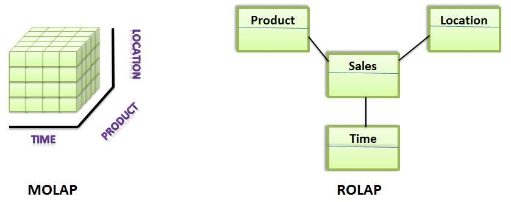
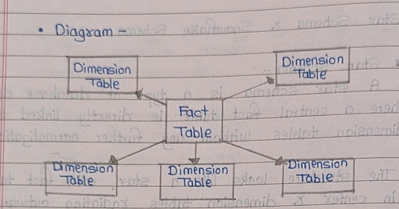
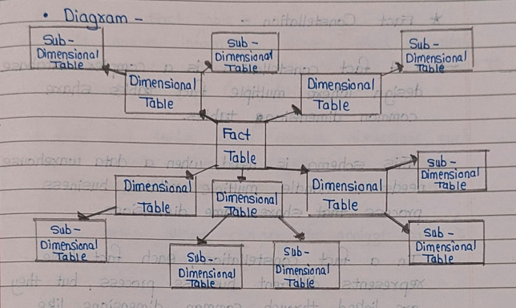

### Q1. Draw and Explain Data Warehouse Tier Architecture. [5]

### **Data Warehouse Tier Architecture**  

A data warehouse is a large storage system where businesses collect, store & manage data from different Sources in an organized way.
• It is used for analyzing data & make better business decisions.
- A data warehouse follows three-tier architecture, which helps in organizing & processing data efficiently.

---

### **1. Bottom Tier (Data Source Layer)**  
🔹 This tier consists of **databases, flat files, and external sources** where raw data is collected.  
🔹 Data is extracted, transformed (cleaned), and loaded (**ETL process**) into the data warehouse.
- It is also known as the **source layer** and is the foundation of the data warehouse.

📌 *Example:* Data collected from CRM, ERP, transaction records, and social media.  

---

### **2. Middle Tier (Data Warehouse Layer)**  
🔹 The core **data warehouse** where processed data is stored in an **organized manner**.  
🔹 Contains **OLAP (Online Analytical Processing)** servers for multi-dimensional analysis.  
🔹 Uses **Data Marts** for department-specific data storage.  

📌 *Example:* A retail company’s warehouse stores **sales, customer, and inventory** data.  

---

### **3. Top Tier (Business Intelligence Layer)**  
🔹 This is the **presentation layer** where users interact with data through BI tools.  
🔹 Includes **dashboards, reports, and visualization tools** for decision-making.  

📌 *Example:* Executives use Power BI or Tableau to analyze sales trends.  

---

### **Diagram of Data Warehouse Architecture**  

📌 The **Three-Tier Architecture** follows this flow:  

```
  +-----------------------------------------+
  |          BI Tools / Visualization       |  <-- Top Tier // Presentation Layer // isme visn batao
  +-----------------------------------------+
                  ⬆
  +-----------------------------------------+
  |    Data Warehouse & OLAP Servers        |  <-- Middle Tier / isme data warehouse banao
  +-----------------------------------------+
                  ⬆
  +-----------------------------------------+
  |  Data Sources (DBs, CRM, Logs, APIs)    |  <-- Bottom Tier
  +-----------------------------------------+
```

---

### **Benefits of Data Warehouse Tier Architecture**  
✅ **Better Performance:** Separates **data processing and reporting**.  
✅ **Scalability:** Can handle **large datasets efficiently**.  
✅ **Improved Decision-Making:** Provides **faster and accurate insights**.  

---

### **Conclusion**  
The **Three-Tier Data Warehouse Architecture** ensures **structured data flow**, enabling efficient **storage, analysis, and visualization**, helping businesses make **data-driven decisions**. ✅

---

### Q2.  Explain Extraction, Transformation, and Loading (ETL) [5]

### **ETL (Extraction, Transformation, and Loading) Process**  

ETL is a **data integration process** used in **data warehousing** to collect, process, and store data for analysis. It consists of **three key steps**:  

---

### **1. Extraction (E) – Collecting Data**  
🔹 Data is extracted from **multiple sources** like databases, APIs, flat files, cloud storage, etc.  
🔹 Ensures **high availability and accuracy** of raw data.  
🔹 Can be done in three ways:  
   - **Full Extraction:** Extracts entire data every time.  
   - **Incremental Extraction:** Extracts only new/changed data.  
   - **Real-time Extraction:** Continuously extracts data in real-time.  

📌 *Example:* Pulling customer transaction data from CRM, ERP, and social media.  

---

### **2. Transformation (T) – Processing Data**  
🔹 The extracted data is **cleaned, formatted, and transformed** to fit the warehouse schema.  
🔹 Key transformation processes:  
   - **Data Cleaning:** Removing duplicates, fixing missing values.  
   - **Data Standardization:** Converting formats (e.g., "Male/Female" → "M/F").  
   - **Data Aggregation:** Summarizing data (e.g., total sales per month).  
   - **Data Validation:** Ensuring correctness and consistency.  

📌 *Example:* Converting date formats from **MM/DD/YYYY** to **YYYY-MM-DD** for consistency.  

---

### **3. Loading (L) – Storing Data**  
🔹 The transformed data is loaded into a **data warehouse or data mart**.  
🔹 Can be done in **two ways**:  
   - **Full Load:** Loads entire data at once (initial setup).  
   - **Incremental Load:** Loads only new/updated records periodically.  

📌 *Example:* Loading processed sales data into a data warehouse for analysis.  

---

### **ETL Process Flow Diagram**  

```
  +-----------------+     +-------------------+     +----------------+
  |  Extraction     | --> | Transformation    | --> |    Loading     |
  | (Raw Data)      |     | (Clean & Format)  |     | (Data Warehouse) |
  +-----------------+     +-------------------+     +----------------+
  // 1st me extraction batao multi sources se
  /// 2nd me transformation batao
  // 3rd me loading batao data warehouse me digram nikalo
```

---

### **Benefits of ETL**  
✅ **Improves Data Quality:** Removes errors and inconsistencies.  
✅ **Enhances Decision-Making:** Structured data allows better analysis.  
✅ **Automates Data Processing:** Saves time by automating data integration.  

---

### **Conclusion**  
🚀 The ETL process ensures **accurate, cleaned, and structured data** is available for **Business Intelligence (BI)**, leading to **better insights and decision-making**. ✅

---

### Q3. Distinguish between Business Intelligence and Data Warehouse. [5]

### **Difference Between Business Intelligence (BI) and Data Warehouse**  

| Feature               | **Business Intelligence (BI)** | **Data Warehouse** |
|-----------------------|--------------------------------|----------------------|
| **Definition** | BI refers to technologies, tools, and strategies used to analyze business data and support decision-making. | A Data Warehouse is a centralized storage system that collects and organizes data from multiple sources for analysis. |
| **Purpose** | Helps in **reporting, data analysis, visualization, and decision-making**. | Provides a **repository** to store and manage historical and structured data. |
| **Process** | Uses **ETL and analytics tools** to generate insights from stored data. | Uses **ETL processes** to collect, clean, and store data from multiple sources. |
| **Data Handling** | Processes and analyzes data from the **data warehouse or other sources**. | Stores **historical and structured data** for long-term use. |
| **Users** | Business analysts, executives, and decision-makers. | IT teams and database administrators manage and maintain it. |
| **Technology Used** | BI tools like **Power BI, Tableau, QlikView, Looker, SAP BI**. | Database systems like **SQL Server, Oracle, Snowflake, Amazon Redshift**. |
| **Real-Time Processing** | Supports **real-time analytics**. | Mostly works with **batch processing** of historical data. |
| **Output** | **Dashboards, reports, and KPIs** for business decision-making. | **Structured, cleaned, and stored data** for analytics. |
| **Example** | Analyzing sales trends using **Power BI dashboards**. | Storing customer purchase history in **Amazon Redshift**. |

### **Conclusion**  
- **Data Warehouse** is the **storage system** where structured data is collected.  
- **Business Intelligence** is the **analytical process** that helps businesses **make decisions** using data from the **Data Warehouse**.  

🚀 *BI is what helps you use data effectively, while a Data Warehouse is where the data lives!* ✅

---

### Q4. State the difference between Difference between OLAP and OLTP. [5]

### **Difference Between OLAP and OLTP**  

| Feature               | **OLAP (Online Analytical Processing)** | **OLTP (Online Transaction Processing)** |
|-----------------------|-----------------------------------------|------------------------------------------|
| **Purpose** | Used for **data analysis and decision-making**. | Used for **day-to-day transactional operations**. |
| **Data Type** | Stores **historical** data to analyze trend and pattern | Stores **current, real-time transactional** data. |
| **Operations** | Performs **complex queries and reporting**. | Performs **INSERT, UPDATE, DELETE, and simple queries**. |
| **Processing Speed** | Optimized for **fast data retrieval and analysis**. | Optimized for **high-speed transaction processing**. |
| **Normalization** | Uses **denormalized** tables (star or snowflake schema) for faster querying. | Uses **normalized** tables to avoid redundancy. |
| **Data Size** | Stores **large volumes of historical data**. | Stores **small, real-time transactional data**. |
| **Data Action** | read only for analysis. | frequently updated with transactions. |
| **Concurrency** | Supports **fewer users** with complex queries. | Supports **many concurrent users** performing transactions. |
| **Examples** | **Business Intelligence (BI), Data Warehousing, Reporting**. | **Banking transactions, e-commerce purchases, reservations**. |
| **Technology Used** | Tools like **Tableau, Power BI, SAP BI, Cognos**. | Databases like **MySQL, PostgreSQL, Oracle, SQL Server**. |
| **Example Query** | "What were the total sales for the last 5 years?" | "Insert a new customer order in the database." |
| **Example Query** | BI Dashboard showing trends for last 5 years | Banking system |

### **Conclusion**  
- **OLAP** is for **analysis & reporting** 📊.  
- **OLTP** is for **fast transactions** 🏦.  

🚀 *OLTP handles real-time business operations, while OLAP helps businesses analyze and make decisions using data!* ✅

---

### Q5. Compare with diagram ROLAP versus MOLAP. [5]

### **Comparison Between ROLAP (Relational OLAP) and MOLAP (Multidimensional OLAP)**  

| Feature              | **ROLAP (Relational OLAP)** | **MOLAP (Multidimensional OLAP)** |
|----------------------|---------------------------|-----------------------------------|
| **Storage Format** | Stores data in **relational databases (RDBMS)**. | Stores data in **multi-dimensional cubes**. |
| **Query Performance** | Slower due to **complex SQL queries**. | Faster due to **pre-aggregated cubes**. |
| **Data Size Handling** | Can handle **large amounts of data** efficiently. | Limited to **moderate data volumes** due to cube size restrictions. |
| **Data Retrieval** | Uses **dynamic calculations** at query time. | Uses **pre-calculated aggregates**, making retrieval faster. |
| **Scalability** | Highly scalable as it works with relational databases. | Less scalable due to cube size limitations. |
| **Storage Space** | Requires **less storage** as it doesn’t store aggregates. | Requires **more storage** due to pre-computed cubes. |
| **Flexibility** | More flexible, as it can handle complex queries dynamically. | Less flexible, as cube structure needs to be predefined. |
| **Technology Used** | Uses databases like **Oracle, SQL Server, PostgreSQL**. | Uses tools like **Microsoft SSAS, Cognos, Essbase**. |
| **Example Query** | Uses SQL to fetch sales data: `"SELECT SUM(sales) FROM sales_table WHERE region='West'"`. | Uses pre-computed cube data for direct retrieval. |

---


### **Conclusion**  
- **ROLAP** is suitable for **large, complex datasets** that need **dynamic querying**.  
- **MOLAP** is best for **fast analysis** with **pre-computed cubes**.  

🚀 *Use ROLAP for scalability & complex queries, and MOLAP for speed & pre-aggregated insights!* ✅

---

# Q6. Explain multi-dimensional data cube analysis with OLAP operations.[5]

### **Multi-Dimensional Data Cube Analysis with OLAP Operations**  

A **multi-dimensional data cube** is a key concept in **OLAP (Online Analytical Processing)**, where data is stored and analyzed across multiple dimensions to support complex queries and business intelligence.  

---

### **1. What is a Multi-Dimensional Data Cube?**  
A **data cube** represents data in **multiple dimensions**, making it easier to perform analytical operations. Each **dimension** represents a different attribute, such as **time, location, and product category**.  

For example, a **Sales Data Cube** may have:  
- **Dimensions**: Time (Year), Product (Category), Location (Region)  
- **Measure (Fact)**: Total Sales  

📌 **Example Representation of a Data Cube:**  
```
              +----------------+
              |   2023  |  2024  |
+------------+----------------+
| Product A  |   $5000  |  $7000 |
| Product B  |   $6000  |  $8000 |
+------------+----------------+
(Region: North)
```

---

### **2. OLAP Operations on Data Cube**  
OLAP provides four major operations for analyzing multidimensional data:  

#### **1️⃣ Roll-Up (Aggregation)**
- Moves **from a lower level to a higher level** in the hierarchy.
- Example: **Summarizing sales data from months to quarters to years**.  

📌 *Example Query:*  
- “Show total sales by **year** instead of **months**.”  

#### **2️⃣ Drill-Down (Decomposition)**
- Moves **from a higher level to a lower level** (opposite of Roll-Up).
- Example: **Viewing sales at the month or day level instead of the year**.  

📌 *Example Query:*  
- “Show total sales for **each month** instead of the whole year.”  

#### **3️⃣ Slice**
- Selects **one dimension and fixes a value**, reducing the cube to a **2D view**.  
- Example: Viewing **sales for 2023 only** across product and region.  

📌 *Example Query:*  
- “Show sales for **only 2023**, across all regions and products.”  

#### **4️⃣ Dice**
- Selects **two or more dimensions** to create a **smaller sub-cube**.  
- Example: Viewing **sales for 2023 and 2024 only for Product A & B in North & South regions**.  

📌 *Example Query:*  
- “Show sales for **Products A & B in North & South regions for 2023-2024**.”  


### **Conclusion**  
📌 **OLAP operations help businesses analyze data from different perspectives.**  
🚀 *These operations improve decision-making, trend analysis, and forecasting!* ✅

---

### Q7. Draw and Explain Star Schema. Also state which is Better: Snowflake Schema Or Star Schema? [5]

### **Star Schema**  
A **star schema** is a type of database design where a central fact table is directly linked to dimension tables without any further normalization.  
- The structure looks like a **star**, with the fact table in the center and dimension tables radiating outward.    
     - Simple and easy to understand.  
     - Fast query performance due to fewer joins.  
   - **Example:** A sales database with a **Sales Fact Table** linked to **Time, Product, and Customer Dimensions**.  

### **Snowflake Schema** ❄️  
   - **Structure:** A more advanced version of the **star schema**, where dimension tables are further divided into **sub-dimensions**.  
   - **Characteristics:**  
     - Reduces data redundancy.  
     - More complex queries due to additional joins.  
   - **Example:** A sales database where the **Product Dimension** is split into **Product Category and Supplier Tables**. 





### **4. Star Schema vs. Snowflake Schema: Which is Better?**  

| Feature               | **Star Schema** | **Snowflake Schema** |
|-----------------------|----------------|----------------------|
| **Structure**         | Central fact table with **denormalized** dimension tables. | Central fact table with **normalized** dimension tables. |
| **Query Performance** | Faster because of fewer joins. | Slower due to multiple joins. |
| **Storage Space**     | Requires more storage (redundant data). | Requires less storage (normalized data). |
| **Complexity**        | Simple and easy to understand. | More complex due to multiple related tables. |
| **Use Case**          | Best for **small to medium data warehouses** with faster querying. | Best for **large data warehouses** where storage efficiency is needed. |

✅ **Conclusion**: **Star Schema** is better for **query performance**, while **Snowflake Schema** is better for **storage efficiency**. 🚀

---

### Q8.  Write down example of Example of Fact Constellation. 

### **Fact Constellation Schema**  

A **fact constellation** is a complex database design where multiple **fact tables** share common **dimension tables**.  
- This schema is used when a data warehouse needs to handle **multiple related business processes** that share the same dimensions.  
- In a fact constellation, each **fact table** represents a different **business process**, but they are linked through common **time, location, and product** dimensions.  
- This structure provides **flexibility** and allows for a **more detailed analysis** across multiple business functions.  

---

### **Example: Retail Company Analyzing Sales & Shipping Data**  

A **retail company** wants to analyze both **sales** and **shipping** data.  

#### **Fact Tables:**  
1. **Sales Fact Table**  
   - Stores details about product sales.  
   - Attributes: **Sales_ID, Product_ID, Customer_ID, Date, Sales_Amount**  

2. **Shipping Fact Table**  
   - Stores information about product shipments.  
   - Attributes: **Shipment_ID, Product_ID, Customer_ID, Date, Shipping_Cost, Delivery_Time**  

#### **Common Dimension Tables:**  
- **Product Dimension** (Product_ID, Product_Name, Category)  
- **Customer Dimension** (Customer_ID, Name, Address)  
- **Time Dimension** (Date, Year, Month, Day)  

This **fact constellation schema** enables a **comprehensive analysis** of both **sales and shipping processes**, leveraging shared dimension tables. 🚀

---
### Q9. List the tools in business Intelligence. Explain any 2 tools. [5]

### **Tools in Business Intelligence (BI)**  
Business Intelligence tools help organizations analyze data, generate insights, and make data-driven decisions. Some commonly used BI tools include:  

1. **Power BI**  
2. **Tableau**  
3. **QlikView**  
4. **SAP BusinessObjects**  
5. **Looker**  
6. **Domo**  
7. **IBM Cognos Analytics**  
8. **MicroStrategy**  
9. **Sisense**  
10. **Google Data Studio**  

---

### **Explanation of Two BI Tools**  

#### **1. Power BI**  
- **Developed by:** Microsoft  
- **Features:**  
  - Data visualization and interactive dashboards.  
  - Connects with multiple data sources (Excel, SQL Server, Cloud).  
  - AI-powered insights and automation.  
- **Use Case:** Businesses use Power BI for real-time reporting and decision-making.  

#### **2. Tableau**  
- **Developed by:** Salesforce  
- **Features:**  
  - Drag-and-drop interface for easy data visualization.  
  - Strong data blending and analytics capabilities.  
  - Supports large datasets and cloud-based analytics.  
- **Use Case:** Widely used in data analytics and reporting for industries like finance, healthcare, and e-commerce. 🚀

---


### Q10. Explain need for business intelligence in different sectors. [5]

### **Need for Business Intelligence in Different Sectors**  

Business Intelligence (BI) is essential across various industries as it helps organizations analyze data, make informed decisions, and improve operational efficiency. Below are some key sectors and the need for BI in each:  

---

### **1. Retail Sector** 🛒  
- **Need:** Customer behavior analysis, demand forecasting, and inventory management.  
- **Example:** BI helps retailers analyze sales trends and optimize stock levels to prevent overstocking or shortages.  

---

### **2. Healthcare Sector** 🏥  
- **Need:** Patient care optimization, fraud detection, and hospital resource management.  
- **Example:** BI enables hospitals to track patient records, reduce wait times, and improve treatment outcomes.  

---

### **3. Banking & Finance Sector** 💰  
- **Need:** Risk management, fraud detection, and customer segmentation.  
- **Example:** Banks use BI to detect fraudulent transactions and personalize financial products for customers.  

---

### **4. Manufacturing Sector** 🏭  
- **Need:** Supply chain optimization, quality control, and production planning.  
- **Example:** BI helps manufacturers predict equipment failures and streamline production processes.  

---

### **5. Education Sector** 🎓  
- **Need:** Student performance tracking, curriculum planning, and resource allocation.  
- **Example:** Universities use BI to analyze student grades and attendance patterns for better academic planning.  

---

### **6. E-commerce Sector** 🛍️  
- **Need:** Personalized marketing, sales forecasting, and customer retention.  
- **Example:** BI helps e-commerce companies analyze customer preferences and recommend products accordingly.  

---

### **7. Logistics & Supply Chain Sector** 🚚  
- **Need:** Route optimization, inventory tracking, and demand forecasting.  
- **Example:** BI assists logistics companies in optimizing delivery routes and reducing transportation costs.  

---

### **8. Government Sector** 🏛️  
- **Need:** Public service efficiency, policy analysis, and crime prediction.  
- **Example:** Governments use BI for traffic management, crime detection, and budget planning.  

---

### **Conclusion**  
BI is **crucial** across all industries as it enhances **decision-making, operational efficiency, and profitability** by leveraging **data-driven insights**. 🚀

---

### Q11. What is Cube? Explain the types of schema design. [5]

### **What is a Cube in Business Intelligence?**  
A **cube** in Business Intelligence (BI) is a **multi-dimensional data structure** that allows for efficient data analysis and retrieval. It organizes data into **dimensions** (such as time, product, and location) and **measures** (such as sales and revenue) to enable fast OLAP (Online Analytical Processing) operations like **slice, dice, drill-down, and pivot**.  

### **Types of Schema Design in Data Warehousing**  

Explain star and snowflake schema:
 

### **Conclusion**  
- **Star Schema** → Best for **simple and fast queries**.  
- **Snowflake Schema** → Best for **reducing data redundancy**.  
- **Fact Constellation Schema** → Best for **handling multiple business processes**.  

🚀 BI uses these schema designs to improve **data organization, analysis, and decision-making efficiency**.