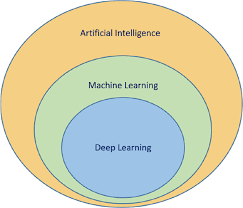
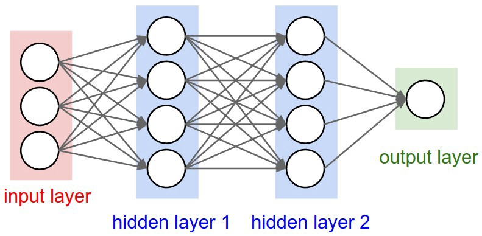
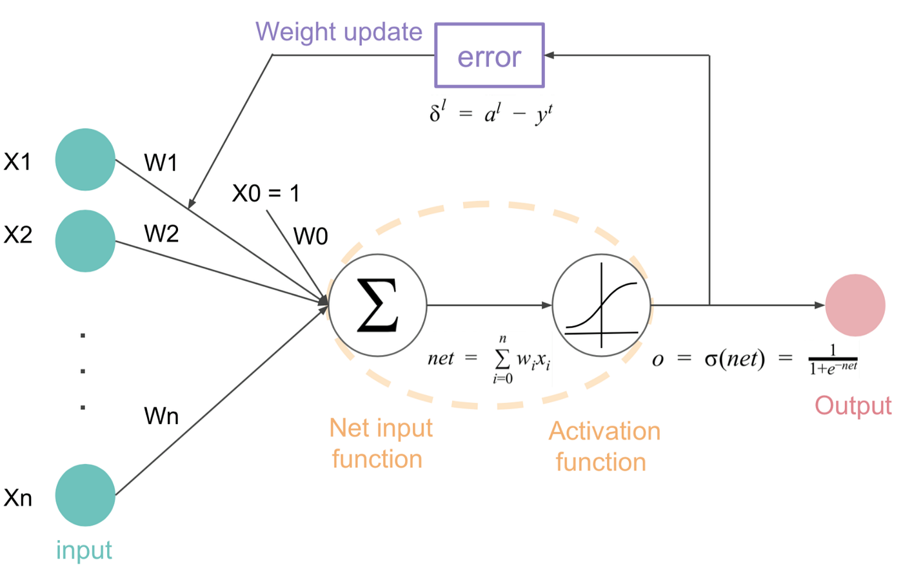

### **Diagram Structure**:
1. **Artificial Intelligence (AI)**  
   - **Machine Learning (ML)**  
     - Supervised Learning  
     - Unsupervised Learning  
     - Reinforcement Learning  
   - **Deep Learning (DL)** (Subset of ML)  
     - Neural Networks  
     - Convolutional Neural Networks (CNN)  
     - Recurrent Neural Networks (RNN)  
   - **Natural Language Processing (NLP)**  
     - Speech Recognition  
     - Text Processing  
     - Chatbots  
   - **Computer Vision**  
     - Image Recognition  
     - Object Detection  
   - **Expert Systems**  
     - Rule-Based Systems  
     - Decision Support Systems  
   - **Robotics**  
     - Autonomous Robots  
     - Humanoids  
---

### Q1.  Give co-relation between Artificial Intelligence, Machine Learning, and Deep Learning. Compare Deep Learning with Machine Learning. [5]

### **Co-Relation between AI, ML, and DL:**
### **Definitions:**

1. **Artificial Intelligence (AI):**  
   AI is a broad field of computer science that aims to create machines capable of performing tasks that typically require human intelligence. These tasks include reasoning, problem-solving, decision-making, and natural language understanding.

2. **Machine Learning (ML):**  
   ML is a subset of AI that focuses on developing algorithms that allow computers to learn from data ,makes the decisions itself and improve their performance over time without explicit programming.
   Instead of following explicit instructions, ML models learn from data and make predictions or decisions based on patterns and relationships within the data.

3. **Deep Learning (DL):**  
   DL is a subset of ML that uses artificial neural networks, which are composed of multiple layers of interconnected nodes or neurons to model complex patterns in data. It is effective in tasks like image recognition, speech processing, and natural language understanding.

AI,ML, and DL are interconnected and interdependent branches of computer science. 
- **AI** is the broadest field, encompassing all efforts to make machines intelligent.
- **ML** is a specialized subset of AI that focuses on data-driven learning.
- **DL** is a further specialization within ML, using deep neural networks for more complex learning tasks.

This relationship can be visualized as:  
**AI ⊃ ML ⊃ DL**  
(Deep Learning is a subset of Machine Learning, which in turn is a subset of Artificial Intelligence).

### **Comparison between Deep Learning and Machine Learning**  

| **Aspect**           | **Machine Learning (ML)** | **Deep Learning (DL)** |
|----------------------|-------------------------|-------------------------|
| **Definition**       | Subset of AI that uses algorithms to learn patterns from data. | Subset of ML that uses deep neural networks to model complex patterns. |
| **Feature Engineering** | Requires manual feature selection and engineering. | Automatically extracts features using multiple layers of neurons. |
| **Data Dependency**  | Works well with small to medium-sized datasets. | Requires large amounts of labeled data for effective training. |
| **Computational Power** | Can run on standard CPUs with moderate processing power. | Requires high-performance GPUs/TPUs due to complex computations. |
| **Time** |It takes less time to train. |More time is required to train. |
| **Applications** | It is used in various applications such as fraud detection, recommendation systems, and predictive maintenance. | It is used in applications such as image recognition, natural language processing, and speech recognition. |

---

### Q2. Explain various limitations of Machine Learning. [5]

### **Limitations of Machine Learning (ML):**  

1. **Data Dependency:**  
   - ML models require large amounts of high-quality, labeled data for effective training. Poor or insufficient data can lead to inaccurate predictions.  

2. **High Computational Cost:**  
   - Training complex ML models, especially deep learning models, requires powerful hardware (GPUs, TPUs) and consumes significant time and energy.  

3. **Lack of Generalization:**  
   - ML models perform well on training data but may fail to generalize effectively to new, unseen data, leading to overfitting.  

4. **Need for Continuous Monitoring & Maintenance:**  
   - ML models degrade over time as data distribution changes (concept drift), requiring regular updates and monitoring to maintain accuracy.  
 

5. **Bias in Data and Models:**  
   - If training data contains biases, ML models can learn and reinforce these biases, leading to unfair or discriminatory outcomes.  

6. **Requirement for Feature Engineering:**  
   - Traditional ML models often require manual selection and transformation of features, which is time-consuming and requires domain expertise.  

7. **Vulnerability to Adversarial Attacks:**  
   - ML models can be manipulated by introducing small, imperceptible changes in input data, making them unreliable in security-sensitive applications.  
  
8. **Legal and Ethical Concerns:**  
   - Issues like privacy, security, and fairness arise when ML models process sensitive data or influence decisions affecting people's lives.  

These limitations highlight the importance of careful data handling, model selection, and ethical considerations when implementing ML systems.

---

### Q3. What is Deep Learning? Enlist and Explain Challenges of the Deep Learning? [5] OR Define Deep Learning. Explain pros and cons of using Deep Learning.[5]

### **What is Deep Learning?**  
Deep Learning (DL) is a subset of Machine Learning that uses artificial neural networks with multiple layers (deep neural networks) to learn complex patterns from data. It is highly effective in tasks such as image recognition, natural language processing, and autonomous systems.

---

### **Pros of Deep Learning:**
1. **Automatic Feature Extraction:**  
   - Unlike traditional ML, DL models automatically learn and extract features from raw data, reducing the need for manual feature engineering.  

2. **High Accuracy:**  
   - Deep learning models achieve state-of-the-art performance in tasks like image classification, speech recognition, and language translation.  

3. **Handles Complex Data:**  
   - Capable of learning from unstructured data like images, audio, and text, making it ideal for applications in vision, speech, and NLP.  

4. **Scalability:**  
   - Can handle large-scale datasets and complex architectures, improving performance with more data and computational resources.  

5. **Continuous Learning:**  
   - Can improve over time with more training data, making it useful for evolving applications like recommendation systems.  

---

### **Cons (Challenges) of Deep Learning:**
1. **High Computational Cost:**  
   - Requires powerful GPUs/TPUs and large amounts of energy for training deep networks.  

2. **Data Dependency:**  
   - Needs massive labeled datasets for training, which may not always be available.  

3. **Black Box Nature:**  
   - Difficult to interpret how the model makes decisions, leading to trust and transparency issues.  

4. **Overfitting:**  
   - Deep networks can memorize training data instead of generalizing well, leading to poor performance on unseen data.  

5. **Long Training Time:**  
   - Training deep learning models can take hours, days, or even weeks, depending on complexity and dataset size.  

Despite these challenges, deep learning remains a powerful tool for solving complex AI problems in various domains.

---

### Q4. Enlist and Explain any four popular industrial tools used for Deep Learning. [5]
### **Five Popular Industrial Tools for Deep Learning** 
Tools are software applications or frameworks that provide a set of tools, libraries, and resources to help developers build, train, and deploy deep learning models. Here are five popular industrial tools for deep learning:

1. **TensorFlow**  
   - Developed by **Google**, TensorFlow is an open-source deep learning framework widely used for building and training neural networks.  
   - It supports **CPU, GPU, and TPU** acceleration for high-performance computing.  
   - Provides **TensorFlow Lite** for mobile deployment and **TensorFlow Serving** for production use.  

2. **PyTorch**  
   - Developed by **Facebook (Meta)**, PyTorch is a flexible deep learning framework known for its dynamic computation graph.  
   - It is widely used in research due to its ease of debugging and **eager execution** mode.  
   - Supports **TorchScript** for converting models to a production-ready format.  

3. **Keras**  
   - A high-level deep learning API built on top of TensorFlow.  
   - It is designed to be simple and user-friendly, making it ideal for beginners and popular for quick experimentation.
   - With Keras, you can easily build and train deep learning models with a few lines of code. No need to write complex code.

4. **Caffe**  
   - Caffe is optimized for **image processing and computer vision** applications.  
   - It is **highly efficient** and used in industrial applications like **deep learning in IoT and edge devices**.  
   - Supports **pre-trained models** through the Caffe Model Zoo.  

5. **OpenCV**  
   - Open-source **computer vision** library widely used for deep learning applications like **object detection, image recognition, and facial recognition**.  
   - Supports integration with **TensorFlow, PyTorch, and Caffe** for deploying deep learning models.  
   - Highly optimized for **real-time image and video processing**.  

These tools play a crucial role in developing, training, and deploying deep learning models across various industries.

---

### Q5.  Explain how Deep Learning works in three figures with one example. Also Explain Common architectural principles of Deep Network. [5]

### **How Deep Learning Works**  

Deep learning works by using **Artificial Neural Networks (ANNs)** with multiple layers to learn patterns from data.  

### **i) Layer 1 - Input Layer**  
- The **input layer** receives raw input data.  
- Deep learning requires **large amounts of data** (e.g., images, text, or numerical values).  

### **ii) Hidden Layers**  
- The neural network consists of **multiple hidden layers**, each responsible for detecting specific features.  
- Example of feature extraction:  
  - **First layer** detects edges.  
  - **Second layer** detects textures or small shapes.  
  - **Third layer** combines these features to recognize objects.  

### **iii) Output Layer**  
- After processing through hidden layers, the **output layer** generates a final prediction.  
- Examples:  
  - Identifying a **cat in an image**.  
  - Translating **text** from one language to another.  
  - Recognizing **speech** and converting it into text.  

---

### **Example: Handwritten Digit Recognition**  
Imagine a deep learning model recognizing handwritten digits (0-9) from images:  
- **Input Layer:** Takes pixel values from images.  
- **Hidden Layers:** Extract features like edges, curves, and patterns.  
- **Output Layer:** Classifies the digit (e.g., **“This image is 7”**).  

### **Common Architectural Principles of Deep Networks**  

1. **Layered Structure:**  
   - Composed of an **input layer, multiple hidden layers, and an output layer**.  

2. **Weights and Biases:**  
   - Each connection has a **weight** (learned during training) and a **bias** to adjust predictions.  

3. **Activation Functions:**  
   - Functions like **ReLU, Sigmoid, and Softmax** introduce non-linearity to learn complex patterns.  

4. **Backpropagation & Gradient Descent:**  
   - The model learns by minimizing errors using **backpropagation** and optimizing weights through **gradient descent**.  

5. **Regularization Techniques:**  
   - Methods like **dropout, batch normalization, and L2 regularization** prevent overfitting and improve generalization.  

These principles ensure deep networks effectively learn patterns from complex datasets, improving accuracy and efficiency.

---

### Q6. Write Short Note on: Under and Over fitting regularization. [5]

### **Note on Underfitting, Overfitting, and Regularization**  

#### **1. Underfitting**  
- **Definition:** Occurs when a model is too simple to capture the underlying patterns in data.  
- **Causes:**  
  - Insufficient model complexity (e.g., too few hidden layers or neurons).  
  - Lack of training data or features.  
  - High bias (assumes a strong simplification).  
- **Effects:**  
  - Poor performance on both training and test data.  
  - High error rates and inability to generalize.  

#### **2. Overfitting**  
- **Definition:** Occurs when a model learns the noise and specific details of training data instead of general patterns.  
- **Causes:**  
  - Excessive model complexity (e.g., too many layers or neurons).  
  - Too much training on limited data.  
  - High variance (model is too sensitive to training data).  
- **Effects:**  
  - Excellent performance on training data but poor performance on test data.  
  - Fails to generalize to new, unseen data.  

#### **3. Regularization**  
- **Definition:** Techniques used to prevent overfitting by controlling model complexity.  
- **Common Methods:**  
  - **L1 & L2 Regularization:** Adds a penalty to large weights (L1 = Lasso, L2 = Ridge).  
  - **Dropout:** Randomly ignores neurons during training to prevent reliance on specific features.  
  - **Batch Normalization:** Normalizes activations to stabilize learning.  
  - **Early Stopping:** Stops training when validation accuracy. staits decreasing, preventing model from learning unnecessay details.  

Regularization ensures the model **generalizes well** to unseen data by balancing complexity and accuracy.

---

### Q7. Write Short note on: Bias, Variance and Tradeoff. [5]

### **Note on Bias, Variance, and Tradeoff**  

#### **1. Bias**  
- **Definition:** Bias refers to the error due to incorrect assumptions in the model.
- **High Bias:**  
  - A model with high bias is too simple & Camat Capture underlying patteins in data.  
  - Example: a a linear regression model trying to predict Complex pattein will have high bias because it assumes relationship is only linear.    
- **Low Bias:**  
  - Model is flexible and can fit the data well.
  
 

#### **2. Variance**  
- **Definition:** Variance refers to model's sensitivity to small changes in training data. Variance measures how much the model’s predictions change with different training datasets.  
- **High Variance:**  
  - A model with high variance learns the training data too well, including noise & random fluctuations, leading to overfitting. 
  - Example: A deep neural network memorizing training data instead of generalizing.  
- **Low Variance:**  
  - Model’s predictions remain stable across different datasets.

#### **3. Bias-Variance Tradeoff**  
- **Definition:** The balance between bias and variance to achieve good model generalization.  
- **Tradeoff Explanation:**  
  - **High Bias, Low Variance → Underfitting** (Model too simple).  
  - **Low Bias, High Variance → Overfitting** (Model too complex).  
  - **Optimal Tradeoff:** A balance where the model generalizes well to unseen data.  

#### **Solution for Good Tradeoff:**  
- **Regularization** (L1/L2, Dropout).  
- **More Training Data** to reduce variance.  
- **Cross-Validation** for model selection.  
- **Feature Selection** to avoid unnecessary complexity.  

A well-balanced model should have **moderate bias and variance**, ensuring good performance on both training and test data.

---

### Q8. Comapre supervised learning and unsupervised learning. [5]
### **Comparison of Supervised and Unsupervised Learning**  

| Feature              | Supervised Learning | Unsupervised Learning |
|----------------------|--------------------|----------------------|
| **Definition**       | Learns from labeled data (input-output pairs). | Learns patterns from unlabeled data without predefined outputs. |
| **Data Type**        | Requires labeled data (e.g., images with labels, spam detection). | Uses unlabeled data (e.g., customer segmentation, anomaly detection). |
| **Goal**            | Predicts outcomes based on past examples. | Finds hidden structures and patterns in data. |
| **Algorithms**      | Examples: Linear Regression, Decision Trees, Neural Networks. | Examples: K-Means Clustering, PCA, Autoencoders. |
| **Complexity**      | Easier to interpret but requires labeled data, which can be costly. | More complex and difficult to evaluate as there’s no ground truth. |
| **Application**     | Used in classification and regression tasks (e.g., spam detection, medical diagnosis). | Used in clustering and dimensionality reduction (e.g., customer segmentation, market analysis). |

Supervised learning is best for **prediction tasks**, while unsupervised learning is ideal for **discovering hidden patterns** in data.

### Q9. Enlist and Explain any four real life applications of Deep Learning. [5]

### **Real-Life Applications of Deep Learning**  

#### **1. Image Recognition (Face Recognition & Object Detection)**  
   - Used in **security systems, social media (Facebook, Instagram), and smartphones** for face unlock.  
   - Deep learning models like **CNNs (Convolutional Neural Networks)** detect faces, objects, and patterns in images.  

#### **2. Autonomous Vehicles (Self-Driving Cars)**  
   - Deep learning helps self-driving cars like **Tesla** detect objects, pedestrians, and road signs.  
   - Uses **CNNs and LSTMs** to process real-time video feeds and make driving decisions.  

#### **3. Healthcare (Medical Diagnosis & Imaging)**  
   - AI models detect diseases from **X-rays, MRIs, and CT scans** (e.g., cancer detection, brain tumor analysis).  
   - **Deep Neural Networks (DNNs)** improve diagnosis accuracy and assist doctors in treatment planning.  

#### **4. Natural Language Processing (Voice Assistants & Chatbots)**  
   - Used in **Google Assistant, Siri, Alexa, and ChatGPT** for voice and text-based interactions.  
   - Models like **Transformers (BERT, GPT)** understand and generate human-like text and speech.  

#### **5. Financial Fraud Detection**  
   - Banks and payment systems use deep learning to detect **fraudulent transactions and cyber threats**.  
   - **Recurrent Neural Networks (RNNs) and Autoencoders** analyze transaction patterns to flag suspicious activities.  

#### **6. Voice Assistants (Speech Recognition & AI Interaction)**  
   - Virtual assistants like **Google Assistant, Siri, and Alexa** use deep learning for speech recognition.  
   - Models like **DeepSpeech and WaveNet** convert voice commands into text and generate responses.  

Deep learning enhances **accuracy, efficiency, and automation** in multiple industries, making it an essential technology in modern applications.
