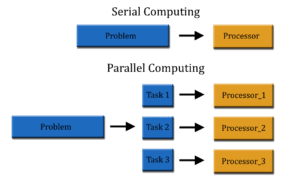
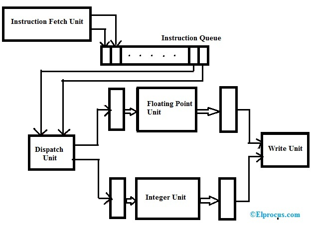

### 410250: Introduction to Parallel Computing 

- **High-Performance Computing (HPC)** refers to the use of powerful computing systems to solve complex problems that require massive computational power, high-speed processing & efficient data handling.
-HPC is widely used in fields like weather forecasting, astrophysics, bioinformatics, etc..
- It involves aggregating computing power to achieve much higher performance than a typical desktop or workstation, enabling large-scale simulations, data analysis, and scientific research.

### Q1. Describe the scope of parallel computing. Give applications of parallel computing. [4]


### **Parallel Computing**  
Parallel computing is a type of computation in which multiple processes or calculations are executed simultaneously by dividing a task into smaller subtasks. These subtasks are processed concurrently using multiple processors or cores to enhance performance, efficiency, and speed. Parallel computing is widely used in high-performance computing (HPC) environments.

---

### **Scope of Parallel Computing**  
The scope of parallel computing is vast and expanding with advancements in hardware and software technologies. Key areas include:  

1. **Scientific Research & Simulations** – Used in weather forecasting, climate modeling, and physics simulations.  
2. **Big Data & Artificial Intelligence** – Enables faster processing of large datasets in machine learning and deep learning.  
3. **Supercomputing & HPC** – Powers large-scale computations in government and research institutions.  
4. **Cloud & Distributed Computing** – Used in cloud services to optimize performance across multiple servers.  
5. **Gaming & Graphics Processing** – Utilized in 3D rendering high-quality graphics in real-time.  
6. **Cryptography & Security** – Speeds up encryption and decryption processes.  

---

### **Applications of Parallel Computing**  
Parallel computing is used in various fields, including:  

1. **Weather Forecasting** – Analyzing complex atmospheric models.  
2. **Medical Imaging** – Enhancing MRI and CT scan processing.  
3. **Artificial Intelligence & Machine Learning** – Training deep learning models.  
4. **Financial Modeling** – Running risk assessments and stock market analysis.  
5. **Aerospace & Defense** – Simulating aerodynamics and missile trajectory analysis.  
6. **Cybersecurity** – Detecting and preventing cyber threats.  
7. **Real-time Data Processing** – Used in IoT and sensor networks for rapid decision-making.  

Parallel computing continues to evolve, offering improved computational power and efficiency across multiple industries.



---

### Q2. Explain basic working principle of Super scalar Architecture? [6]

### **Superscalar Architecture**  
- Superscalar architecture is a type of processor design that allows multiple instructions to be executed simultaneously in a single clock cycle by using multiple execution units.
- It enhances CPU performance by executing more than one instruction per cycle w/o increasing clock speed
- unlike scalar processors, which execute one instruction per cycle.



### **Basic Working Principle of Superscalar Architecture**  
The key principles behind superscalar architecture include:  

1. **Instruction Fetching** – The processor fetches multiple instructions at a time from memory. The fetched instructions are placed in instruction queue T which helps manage flow of execution.  
2. **Instruction Decoding** – The fetched instructions are decoded to determine their dependencies and execution units required.  
3. **Instruction Dispatching** – The dispatch unit checks dependencies & sends independent instructions to different execution units simulltaneously.
4. **Parallel Execution** – Multiple execution units (ALUs, FPUs, etc.) execute instructions in parallel.Floating point units (FPUs) , Integer Units (ALUs).
5. **Writing Unit** – Then processed instructions are sent to Write Unit, where results are stored & used for next stages of computation..  

### **Key Features of Superscalar Architecture**  
- Multiple execution pipelines.  
- Parallel instruction execution.  
- Reduced execution time and improved CPU throughput.  
- Dependency checking to ensure correctness.  

Superscalar architecture is widely used in modern microprocessors, such as Intel Core and AMD Ryzen CPUs, to achieve high performance through parallel instruction execution.

---

### Q3. What is VLIW processor? Write any two advantages of VLIW? [4]

### **VLIW (Very Long Instruction Word) Processor**  
- A **VLIW (Very Long Instruction Word) processor** is a type of CPU architecture that allows multiple operations to be executed in a single instruction cycle by packing multiple independent instructions into one long instruction word.
- Unlike superscalar processors, which rely on dynamic instruction scheduling, VLIW processors depend on the compiler to determine instruction parallelism at compile time.
- VLIW processors are designed to execute multiple instructions in parallel
- This reduces the need for complex hardware for instruction scheduling and dependency checking, making it a simpler and more cost-effective solution.

---

### **Advantages of VLIW Processors**  

1. **Simplified Hardware Design** – No need for complex hardware for instruction scheduling and dependency checking, reducing CPU design complexity.  
2. **Efficient Parallelism** – Achieves high instruction-level parallelism (ILP) by executing multiple instructions simultaneously.  
3. **Lower Power Consumption** – Reduced control hardware leads to lower energy consumption compared to superscalar architectures.  
4. **Higher Compiler Optimization** – The compiler handles instruction scheduling, reducing runtime overhead on the processor.  
5. **Cost-Effective Implementation** – Simpler design results in reduced manufacturing costs.  

VLIW processors are commonly used in applications where predictable execution is essential, such as graphics processing, AI acceleration, and digital signal processing.

---

### Q4. Explain with suitable diagram SIMD, MIMD architecture. [4]

### **SIMD & MIMD Architectures**  

SIMD (Single Instruction, Multiple Data) and MIMD (Multiple Instruction, Multiple Data) are two types of parallel computing architectures classified under **Flynn's Taxonomy**.

---

### **1. SIMD (Single Instruction, Multiple Data)**  
- **SIMD architecture** is parallel computing instruction architecture where a single control unit applies the same instruction to multiple data elements simultaneously.  
- It is useful for tasks that require same operation on large datasets, such as image processing & machine learning.


#### **Diagram of SIMD Architecture**  
```
            +---------------------+
            | Memory Unit        |
            +---------------------+
                     |
            +---------------------+
            | Control Unit        |
            +---------------------+
                     |   ->Instruction Bus
  -----------------------------------
  |           |           |           |
  PU1        PU2        PU3         PU4   (Processing Units)
  |           |           |           |
 D1          D2         D3          D4    (Different Data Sets)
```
- **PU = Processing Unit**
- **D = Data**

##### **Key Features of SIMD:**
- Efficient for tasks with **data-level parallelism**.
- Used in **vector processors, GPUs, and multimedia processing**.
- Low control overhead as a single instruction is broadcasted to all processing units.

---

### **2. MIMD (Multiple Instruction, Multiple Data)**  

- MMID is a more flexible architecture where multiple instructions operate on multiple data elements simultaneously.
Each processor can execute different instruction independently, making it ideal for complex computing tasks like simulations & cloud computing:

#### **Diagram of MIMD Architecture**  
```
            +---------------------+
            | Memory Unit        |
            +---------------------+
                     |
      ------------------------------
     |            |              |
    CU1          CU2           CU3 (Multiple Control Units)
     |            |              |  Instruction Bus
    PU1          PU2           PU3    (Processing Units)
   /  \          /  \          /  \
 I1   D1      I2   D2      I3   D3    (Different Instructions & Data)
```
- **I = Instruction**
- **D = Data**
- **PU = Processing Unit**

##### **Key Features of MIMD:**
- Provides **high flexibility** as processors work independently.
- Used in **multi-core CPUs, distributed computing, and cloud computing**.
- Suitable for **complex computations like AI, simulations, and scientific computing**.

---

### **Comparison Table: SIMD vs. MIMD**
| Feature | SIMD | MIMD |
|---------|------|------|
| Control Unit | Single | Multiple |
| Instructions | Single | Multiple |
| Data | Multiple | Multiple |
| Parallelism Type | Data Parallelism | Task Parallelism |
| Efficiency | High for repetitive tasks | High for diverse workloads |
| Application | GPUs, image processing, deep learning | Multi-core CPUs, cloud computing, AI |

Both architectures play a crucial role in modern computing, with **SIMD excelling in vector operations** and **MIMD powering multi-core processing systems**.

---

### Q5. Describe UMA and NUMA multicomputer platforms? [5]

### **UMA and NUMA Multicomputer Platforms**  

**UMA (Uniform Memory Access)** and **NUMA (Non-Uniform Memory Access)** are two types of memory architectures used in multiprocessor systems.

---

## **1. UMA (Uniform Memory Access) Architecture**  
- In **UMA architecture**, all processors share a single, uniform memory with **equal access time**.
- It is commonly used in **symmetric multiprocessing (SMP) systems**.
- It is simple to implement and manage as all processors can communicate easily without worrying about memory access delay
- However, when the number of processors increases, the memory access time increases, leading to performance degradation.

### **Diagram of UMA Architecture:**  
```
       +----------------------+
       |   Shared Memory      |
       +----------------------+
              |   |   |
     --------------------------
     |         |         |
   CPU1      CPU2      CPU3     (Processors)
```

### **Advantages of UMA:**
✔ **Simple design** with uniform access time.  
✔ **Efficient for small-scale multiprocessing**.  
✔ **Easier programming model** due to uniform memory access.  

### **Disadvantages of UMA:**
✘ **Scalability issues** as the number of processors increases.  
✘ **Memory contention** as multiple CPUs compete for the same memory.  

### **Applications of UMA:**
- Used in **workstations, servers, and small multiprocessor systems**.

---

## **2. NUMA (Non-Uniform Memory Access) Architecture**  

- NUMA is a memory architecture where processors have their own local memory but can also access from other processors' memory.
- Access time varies depending on whether memory is local or remote.**Faster access to local memory**, slower access to remote memory.
- It is used **high-performance computing and large-scale multiprocessors** like supercomputers.
- This design improves **scalability** in large multiprocessor systems.


### **Diagram of NUMA Architecture:**  
```
       +-----------------------+    +-----------------------+
       |   Local Memory 1      |    |   Local Memory 2      |
       +-----------------------+    +-----------------------+
                |                        |
            CPU1 ---- Interconnect ---- CPU2    (Processors)
                |           X             |
            CPU3 ---- Interconnect ---- CPU4    (Processors)
                |                        |
       +-----------------------+    +-----------------------+
       |   Local Memory 3      |    |   Local Memory 4      |
       +-----------------------+    +-----------------------+
```

### **Advantages of NUMA:**
✔ **Better scalability** for large systems.  
✔ **Reduces memory bottlenecks** by providing local memory.  
✔ **Efficient resource utilization** for distributed workloads.  

### **Disadvantages of NUMA:**
✘ **Complex memory management** compared to UMA.  
✘ **Higher latency when accessing remote memory**.  

### **Applications of NUMA:**
- Used in **supercomputers, large databases, and cloud computing**.  
- Common in **high-end servers (e.g., AMD EPYC, Intel Xeon systems)**.  


### **Conclusion**
- **UMA is suitable for small-scale multiprocessors**, where memory access time is uniform.  
- **NUMA is preferred for large-scale multiprocessing systems**, where memory locality is crucial to performance.

---

### Q6. Explain the impact of Memory Latency & Memory Bandwidth on system performance. [6]

### **Memory Latency & Memory Bandwidth**  

#### **1. Memory Latency**  
**Memory Latency** refers to the delay between a processor requesting data from memory and the time it receives that data. It is measured in **nanoseconds (ns)** or **clock cycles**.  
- Lower latency means faster data retrieval, improving system performance.

##### **Impact on System Performance:**  
- **Higher latency slows down CPU execution** as the processor must wait for data.  
- **Lower latency leads to faster execution** of programs and applications as data is readily available.
- **Affects real-time applications** like gaming, AI, and data analytics, where quick data retrieval is essential. 
- Catching techniques and optimizing memory access patterns can reduce latency.

**Ways to Reduce Memory Latency:**  
✔ Using **cache memory** to store frequently used data.  
✔ Implementing **faster RAM (e.g., DDR5 over DDR4)**.  
✔ Employing **memory prefetching** to load data before it is needed.  

---

#### **2. Memory Bandwidth**  
**Memory Bandwidth** is the amount of data that can be transferred between memory and the processor per second. It is measured in **GB/s (gigabytes per second)**.
- Higher bandwidth means faster data transfer, improving system performance.

##### **Impact on System Performance:**  
i) Higher bandwidth supports faster execution of large data operations like graphic rendering & HPC.
ii) Low bandwidth creates bottleneck, slowing down matan data intensive applications. 
iii) Affects real-time applications like gaming, AI, and data analytics, where quick data retrieval is essential.

**Ways to Improve Memory Bandwidth:**  
✔ Using **higher-speed RAM (e.g., DDR5, GDDR6 for GPUs)**.  
✔ Increasing the **memory bus width** (e.g., from 64-bit to 128-bit).  
✔ Implementing **multi-channel memory architectures** (e.g., dual-channel, quad-channel).  

Balancing both is essential for **high-performance computing, gaming, AI, and real-time applications**.

---

### Q7. Explain Message Passing Costs in Parallel Computers in parallel machines.

### **Message Passing Cost in Parallel Computers**  

In **parallel computers**, multiple processors work together by **exchanging data** through a communication **network**. This communication is essential for **coordinating tasks** and ensuring efficient execution of parallel programs.  

#### **Message Passing in Parallel Systems**  
- **Message Passing** is a technique where **one processor sends a message**, and **another processor receives it**.  
- This data exchange occurs over **interconnection networks**, such as **shared memory buses, crossbar switches, or high-speed links**.  
- Efficient message passing ensures **smooth coordination** between processors, improving overall system performance.  

#### **Cost of Message Passing**  
The **cost of message passing** refers to the **time and resources needed for data exchange** between processors. It includes:  

1. **Startup Time (Latency,  T_s )** – The time required to initiate communication.  
2. **Transmission Time ( T_t )** – The time taken to transfer the message over the network. It is given by:  
   
   T = M/B
   
   Where:  
   -  M  = Message size (in bytes)  
   -  B  = Bandwidth of the network (in bytes per second)  
3. **Waiting Time (Synchronization Overhead,  T_w )** – Delays due to network congestion or waiting for messages.  

#### **Total Message Passing Time ( T_m )**  
The overall time required for message passing is:  

T(m) = T(s) + M/B+ T(w)

Where:  
-  T_m  = Total message passing time  
-  T_s  = Startup time (latency)  
-  \frac{M}{B}  = Transmission time  
-  T_w  = Waiting time due to network contention  

#### **Impact on Parallel System Performance**  
- If **message passing is slow** or **inefficient**, processors spend more time **waiting for data** instead of computing.  
- This results in **higher execution time**, reducing the benefits of parallelism.  
- **High-speed computations** require **low-latency** and **high-bandwidth** communication to maximize performance.  

By optimizing message passing mechanisms, parallel systems can achieve **better scalability, efficiency, and performance** for complex computations.

---

### Q8. Write note on Communication costs in parallel machines? [5]

### **Communication Costs in Parallel Machines**  

In **parallel computing**, multiple processors work together to solve a problem. However, they need to **communicate** with each other to share data and synchronize operations. This communication introduces **overhead**, which affects overall system performance.  

---

### **Components of Communication Costs**  

Upar ka hi likho, just message passing ki jagah communication cost likho

### **Impact of Communication Costs on Parallel Performance**  

- **High Communication Overhead** → Reduces parallel efficiency.  
- **Slow Message Passing** → Causes processor idling, increasing execution time.  
- **Network Bottlenecks** → Affect scalability in large parallel systems.  
- **Load Imbalance** → Delays if some processors wait longer for data.  


### **Conclusion**  
Communication cost is a **critical factor** in parallel computing. High **latency, transmission delays, and synchronization overhead** can reduce system performance. Efficient communication strategies **enhance scalability, speedup, and parallel efficiency** in high-performance computing systems.

---

### Q9. Explain
 i) Dataflow Models
ii) Demand Driven Computation
iii) Cache Memory

## **i) Dataflow Models**  

### **Definition:**  
A **Dataflow Model** is a computation model where the execution of instructions is **determined by the availability of data** rather than a predefined sequence of instructions (like in traditional von Neumann architecture).  

### **Working Principle:**  
- **Data Dependencies:** Instructions execute **only when all required input data is available**.  
- **Parallelism:** Multiple instructions can execute **simultaneously** if their input data is ready.   
- **No Central Control:** Execution progresses **dynamically** based on the readiness of input data.  

### **Types of Dataflow Models:**  
1. **Static Dataflow Model:**  
   - Each instruction executes **once** per activation.  
   - Well-suited for **simple parallel computations**.  

2. **Dynamic Dataflow Model:**  
   - Allows instructions to execute **multiple times** with different data sets.  
   - Supports **higher flexibility and parallelism**.  

### **Advantages:**  
✔ Efficient use of **parallelism**.  
✔ No need for **global program counter** (eliminates instruction fetch bottleneck).  
✔ Ideal for **high-performance computing** (e.g., scientific simulations, AI processing).  

### **Disadvantages:**  
✘ **Complex hardware** design needed.  
✘ **Difficult to implement** in general-purpose processors.  
✘ **Higher data management overhead**.  

---

## **ii) Demand Driven Computation**  

### **Definition:**  
- Demand-driven computation is a technique where **computation occurs only when needed**, meaning an operation is executed **only when its result is explicitly required**.
- Instead of computing all possible results. in dini advance, system waits until specific value is requested & then executes only the necessary operations to produce that value.
- This approach helps save time, memory & processing power by avoiding unnecessary computations  
- This technique is widely used in functional programming, database query optimization, etc..
- For eg, in databases, a query retrieves & processes only the required data xather than scanning the entire dataset.
- By reducing computations, demand driven computation improves system efficiency, optimizes resource usage enhances performance

### **Applications:**  
✔ **Virtual Memory Systems** – Pages are loaded **only when accessed**.  
✔ **Functional Programming** – Supports **lazy evaluation** (e.g., Haskell, Lisp).  
✔ **Database Query Optimization** – Queries fetch **only relevant** data instead of full datasets.  

### **Advantages:**  
✔ **Efficient memory usage** (computes only required values).  
✔ **Performance improvement** in cases where **not all data is needed**.  
✔ Reduces **unnecessary computations** in large-scale problems.  

### **Disadvantages:**  
✘ May **increase overhead** due to **on-demand computation tracking**.  
✘ **Not always faster**—extra time may be required to **determine dependencies**.  

---

## **iii) Cache Memory**  

### **Definition:**  
- Cache Memory is a small, high-speed memory that stores frequently accessed data & instructions to speed up processing.
- It acts as buffer between memory (RAM) and CPU , reducing time taken to fetch data.
- Since cache memory is much faster than RAM, it helps improve overall performance of computer.

### **Working Principle:**  
- When the CPU needs data:  
  1. It first checks in the **cache** (fast access).  
  2. If **data is found** (**cache hit**), it is fetched quickly.  
  3. If **data is not found** (**cache miss**), it is retrieved from main memory and stored in the cache for future use, which takes time

### **Types of Cache Memory:**  
1. **L1 Cache (Level 1):**  
   - Smallest but **fastest** (located inside CPU).  
2. **L2 Cache (Level 2):**  
   - Larger than L1, slightly **slower but still faster than RAM**.  
3. **L3 Cache (Level 3):**  
   - Shared among multiple cores, **larger but slower than L1 & L2**.  

### **Advantages:**  
✔ **Reduces CPU-memory access time**, improving speed.  
✔ **Increases overall system performance**.  
✔ **Minimizes memory bottleneck issues**.  

### **Disadvantages:**  
✘ **Expensive** compared to RAM.  
✘ **Limited size** (cannot store all frequently used data).  
✘ **Cache coherence issues** in multi-core processors.  

----